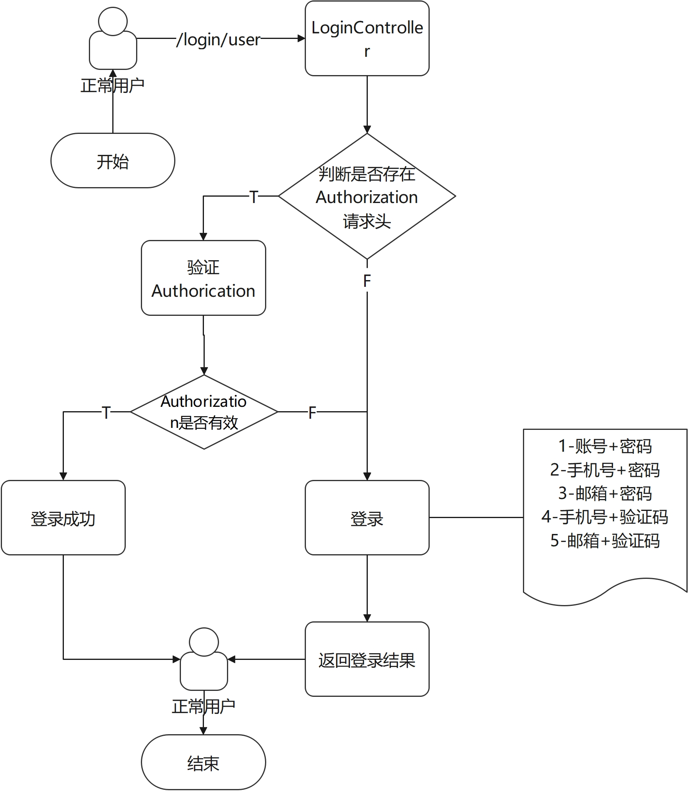
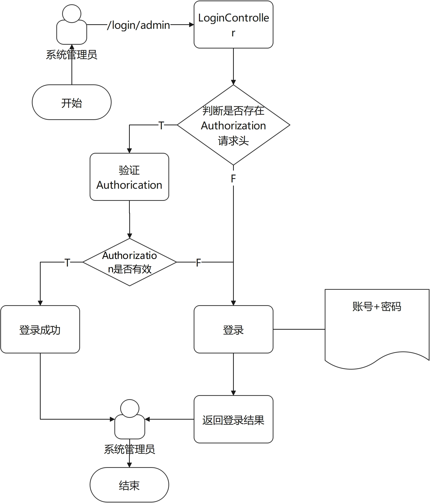

## 接口文档

### LoginController

- 正常用户登录
- 管理员登录

#### 正常用户登录

**URL：**`/login/user`

**流程：**

#### 管理员登录

**URL：**`/login/admin`

**流程：**

### UserContrller

`UserController`包含正常用户的相关操作

- 发送注册验证码（包括邮箱和手机）：`/user/send-code/register`
- 注册：`/user/register`
- 获取用户信息：`/user/get-information`
- 更新用户非关键性信息：`/user/update-information`
- 更新邮箱：`/user/update-email`
- 更新手机号：`/user/update-phone`
- 邮箱更新中原邮箱验证码发送：`/user/send-code/update-email`
- 邮箱更新中新邮箱验证码发送：`/user/send-code/update-email1`
- 手机号更新中原手机号验证码发送：`/user/send-code/update-phone`
- 手机号更新中新手机号验证码发送：`/user/send-code/update-phone1`

#### 登录模块
##### 请求和响应格式

##### 用户权限流程图

##### 登录和自动登录流程图

#### 用户模块
##### 注册流程图

